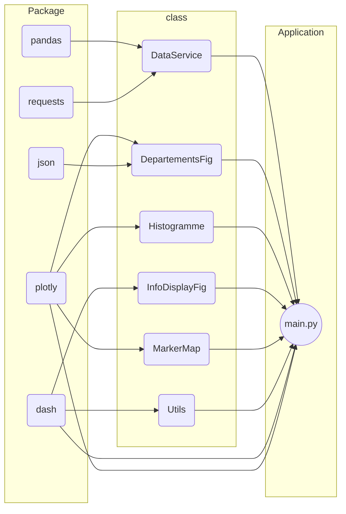
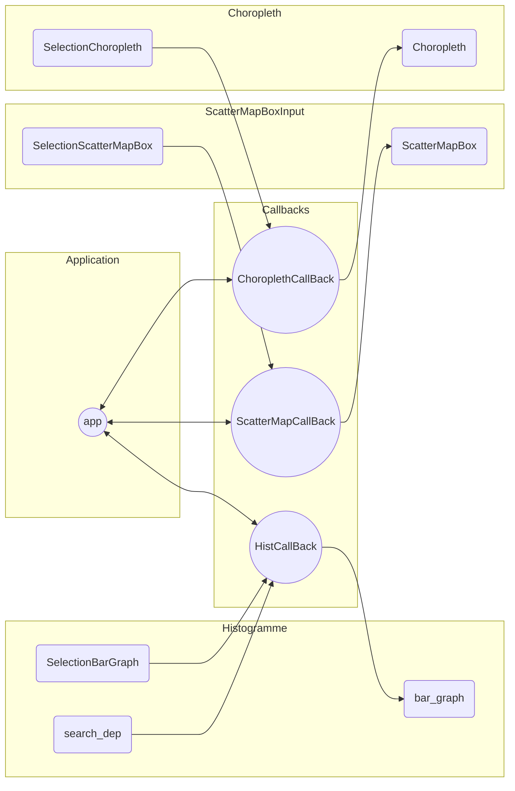

User Guide
=============================================

Présentation
===========================================
Ce projet permet de démarrer un dashboard sur votre machine locale et pouvoir étudier un jeu 
de données présentant le diagnostic des DPE avec la consommation energétique et l'estimation de GES de nombreuses maisons françaises.

>DPE : diagnostic de performance énergétique (DPE) qui renseigne sur la performance énergétique et climatique 
> d’un logement ou d’un bâtiment (étiquettes A à G)

Ce guide vous permettra de déployer et d'utiliser le dashboard sur une autre machine.

Prérequis
-----------------------------------------------

Pour pouvoir lancer le dashboard vous devez installer git ou télécharger le dépôt sur votre espace personnel

Vous pouvez cloner le dépôt facilement à l'aide de la commande

    git clone https://github.com/MrWillBeEsiee/pythonDpeEtude.git

Pour pouvoir utiliser le dashboard, vous aurez besoin d'installer les librairies suivantes :
* plotly (version 5.11 mini)
* dash
* pandas

Vous pouvez les installer en utilisant la commande pip install comme ceci :

    pip install dash pandas plotly requests

Vous pouvez aussi installer toutes les librairies de cette façon :

    python -m pip install -r requirments.txt

Si vous avez déjà plotly mais dans une version inférieur à 5.11 vous pouvez le mettre à jour comme ceci :
    
    pip install plotly -U

Informations générales
------------------------------------------------
Le dataset utilisé pour cette étude comporte 100 000 valeurs récupérées à la volée par l'API de l'ADEME
: https://data.ademe.fr/datasets/dpe-france
Vous pouvez vous rendre sur le site ci-dessus pour consulter quelques prémices d'études et visualiser le dataset.

>Gardez en mémoire que ce travail est encore en cours de developpement
et il se peut que quelques irrégulartiés dans les dataset ne soient pas gérés correctement.
Si tel est le cas contactez-nous par mail : william.benadiba@edu.esiee.fr ou karim.ali@edu.esiee.fr

Utilisation
-----------------------------------------------
Maintenant que vous avez toutes les dépendances il vous suffit de lancer le programme avec la commande ci-dessous
et de vous rendre à l'adresse http://127.0.0.1:8050/ qui est local à votre ordinateur

    python main.py

Vous devriez voir s'ouvrir une fenêtre de votre navigateur avec le dashboard.

Le dashboard vous permet de visualiser différentes informations sur les maisons consommatrices d'énergie
et polluantes en France.
Vous pouvez sélectionner différents éléments sur chaque graphique pour filtrer les données affichées.

Par exemple, vous pouvez sélectionner un département dans la boîte de dialogue et appuyer sur _ENTREE_ pour afficher l'histogramme
de la répartition des classes de consommation d'énergie ou d'émission de gaz à effet de serre pour ce département.

Vous pouvez également observer la répartition des maisons du dataset et leur pollution, ou encore observer les emissions et
 consommations moyennes par régions.

>Notez qu'à la fin du dashboard vous pouvez avoir un résumé statistique du dataset et parcourir celui-ci.

Bugs connus
-----------------------------------------------
Sur la carte interactive avec les maisons et leur consommations le premier affichage s'affiche mal et la légende n'est pas
dans l'odre. Vous pouvez cliquer sur _carte avec clusters_ pour réactualiser celle-ci qui s'affichera correctement.

Rapport d'analyse
=============================================
Nous pouvons tirer plusieurs conclusion de cette étude :

* La répartition des maisons consommatrices d'énergie est inégale dans l'ensemble de la France. En effet, certaines régions
comme la Normandie ou la Bretagne ont une proportion significativement plus élevée de maisons classées dans les catégories
"A" et "B" en termes de consommation d'énergie, tandis que d'autres régions comme l'Île-de-France ou la PACA ont une
proportion plus importante de maisons classées dans les catégories "E", "F" et "G".
* La majorité des maisons françaises sont classées dans la catégorie "D" en termes de consommation d'énergie. Cela montre que
la consommation moyenne en énergie des maisons en France se situe autour de la moyenne nationale.
  
On remarque aussi que les habitations les plus polluantes ne semblent pas se situer où on aurait pu l'imaginer notament à Paris
et ses alentours mais plutôt le long de la diagonale du vide de la Meuse aux Landes où la densité de population y est faible.

Lorsqu'on regarde les moyennes de consommation des habitations sur le territoire français, nous notons une moyenne de 239
kWhEP/m2 et une estimation d'émission de gaz à effet de serre de 31 CO2/m2.

###Conclusion 
Nous ne sommes pas encore aux objectifs attendus par la France : _classe A et B pour toutes les habitations_ puisque la moyenne 
française est entre D et E.

Cependant les pays du sud et notamment ceux de la côte Ouest ont des résultats environ 20 % plus bas (en termes de consommation et rejets)
cela est sûrement dû aux températures plus élevées qui nécessitent moins d'isolation et d'investissement dans des dispositifs moins énergivores.

Developer Guide
===================================================

Structure du projet
---------------------------------------------------
Le projet se base sur les librairies _dash_ et _plotly_ de la société canadienne _dash.Inc_
Plotly permet la génération de graphique dynamique et dash permet de créer un dashboard en ne 
manipulant exclusivement que du python.

    /!\ Dans ce projet nous n'utilisons que le sous package pltoly.express

Les documentations sont disponibles ici :

plotly : https://plotly.com/python/

plotly.express : https://plotly.com/python-api-reference/plotly.express.html

dash : https://dash.plotly.com/

Les dataset sont enregistrés et filtrés à l'aide de la célèbre librairie très bien documenté _pandas_.

pandas : https://pandas.pydata.org/docs/

Le projet comporte une classe main qui appelle différents services pour la génération de ses objets :
* La service d'instanciation du jeu de donnée :
  * DataService
* Les classes d'instanciation des graphiques :
  * Departement fig
  * Histogramme
  * MarkerMap
  * InfoDisplayFig  
* Les composants d'affichage html :
  *  Utils
    
**Vous pouvez voir ici les dépendances des classes entre-elles.**

Nous avons essayé au maximum de réduire le couplage

Structure des callback
-------------------------------------------------

Dash embarque un principe de callback pour les éléments qu'il affiche.

Vous pouvez donc facilement mettre à jour dans le dashboard des graphiques (entre autres) en 
signifiant les entrées à prendre en compte et comme sortie les objets à modifier 

**Ici vous pouvez voir comment sont structuré les CallBack pour mieux visualiser le fonctionnement
du dash**

On voit ici que de manière générale l'application demande un CallBack

Le service concerné récupère les entrée et les injecte dans la sortie

Pour tout renseignement n'hésitez pas à nous contacter sur github via la section _Issues_
Ou contactez nous sur notre adresse profesionnel : 

_william.benadiba@edu.esiee.fr_
                                                   

_karim.ali@edu.esiee.fr_

Copyright
==========================================
Nous déclarons sur l’honneur que le code fourni a été produit par nous-même.

