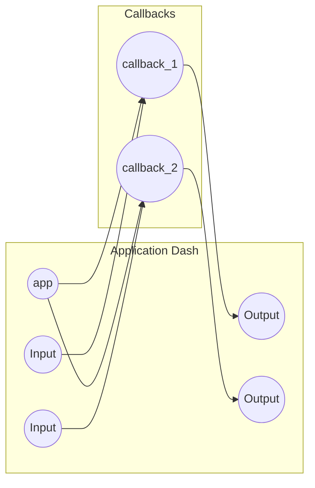

User Guide
=============================================
![(https://www.esiee.fr/sites/all/themes/custom/esiee_theme/logo.png)]
Ce guide vous permettra de déployer et d'utiliser le dashboard sur une autre machine.

Prérequis
-----------------------------------------------
Pour pouvoir utiliser le dashboard, vous aurez besoin d'installer les librairies suivantes :
* plotly (version 5.11 mini)
* dash
* pandas

Vous pouvez les installer en utilisant la commande pip install comme ceci :

    pip install dash pandas plotly requests

Vous pouvez aussi installer toutes les librairies de cette façon :

    python -m pip install -r requirements.txt

Si vous avez déjà plotly mais dans une version inférieur à 5.11 vous pouvez le mettre à jour comme ceci :
    
    pip install plotly -U

Informations générales
------------------------------------------------
Le dataset utilisé pour cette étude comporte 100 000 valeurs récupérés à la volée par l'API de l'ADEME
!(https://data.ademe.fr/datasets/dpe-france)
Vous pouvez vous rendre sur le site pour consulter quelques prémices d'étude et visualiser le dataset.

>Gardez en mémoire que ce travail est encore en cours de developpement
et il se peut que quelques irrégulartiés dans les dataset ne soient pas gérés correctement.
Si tel est le cas contactez moi par mail : william.benadiba@edu.esiee.fr

Utilisation
-----------------------------------------------
Une fois les dépendances installées, vous pouvez lancer le dashboard en exécutant le fichier **main.py**. 

Vous devriez voir s'ouvrir une fenêtre de votre navigateur avec le dashboard.

Le dashboard vous permet de visualiser différentes informations sur les maisons consommatrices d'énergie
et polluantes en France.
Vous pouvez sélectionner différents éléments sur chaque graphique pour filtrer les données affichées.

Par exemple, vous pouvez sélectionner un département dans la liste déroulante pour afficher l'histogramme
de la répartition des classes de consommation d'énergie ou d'émission de gaz à effet de serre pour ce département.
Vous pouvez également utiliser la barre de recherche pour rechercher un département en particulier.

Bugs connus
-----------------------------------------------
Sur la carte interactive avec les maisons et leur consommations le premier affichage s'affiche mal la légende n'est pas
dans l'odre. Vous pouvez cliquez sur _carte avec clusters_ pour réactuliser la carte qui s'affichera correctement

Rapport d'analyse
=============================================
Nous pouvons tirer plusieurs conclusion de cette étude

* La répartition des maisons consommatrices d'énergie est inégale dans l'ensemble de la France. En effet, certaines régions
comme la Normandie ou la Bretagne ont une proportion significativement plus élevée de maisons classées dans les catégories
"A" et "B" en termes de consommation d'énergie, tandis que d'autres régions comme l'Île-de-France ou la région PACA ont une
proportion plus importante de maisons classées dans les catégories "E", "F" et "G".
* La majorité des maisons françaises sont classées dans la catégorie "D" en termes de consommation d'énergie. Cela montre que
la consommation moyenne en énergie des maisons en France se situe autour de la moyenne nationale.

Developper Guide
===================================================

